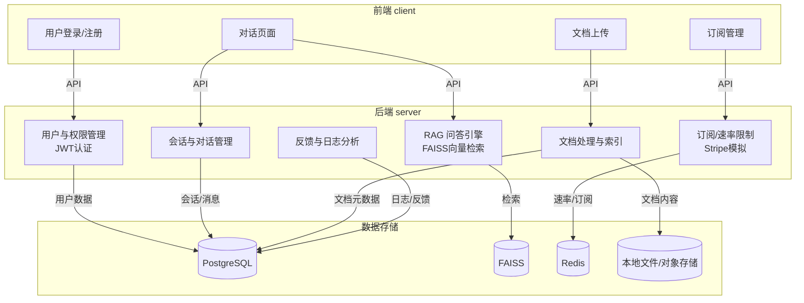

# 技术架构与功能实现总结

## 系统整体架构

本项目采用前后端分离架构，前端使用 React + Vite，后端基于 FastAPI，向量检索采用 FAISS，LLM 支持 Anthropic Claude（可扩展 OpenAI/HuggingFace），数据库为 PostgreSQL，Redis 用于速率限制与缓存。系统支持容器化部署（Docker Compose）。

## 架构模块图

## 核心功能实现

1. **用户账户 & 鉴权系统**
   - 支持用户注册、登录，基于 JWT 的 Token 认证（见 `auth.py`）。
   - 用户信息、会话历史存储于 PostgreSQL。
   - 用户登录后可获取/管理自己的对话历史（见 `getConversations`）。

2. **付费订阅与权限管理**
   - 免费用户每日对话次数限制（如 10 次），订阅用户无限制并可选更强模型（如 Claude Opus）。
   - 订阅系统支持 Stripe/Paddle 模拟，订阅等级控制见 `users.py`。
   - 速率限制与权限校验在后端统一处理

3. **RAG 问答核心系统**
   - 用户提问时，后端检查权限与速率，调用 FAISS 检索相关文档段落（见 `RAGService.query_with_rag`）。
   - 检索结果与用户问题拼接 Prompt，调用 LLM 生成最终回答。
   - 支持 PDF/Markdown/TXT 文档上传，自动分片并建立向量索引（见 `app/services/rag_service.py`）。
   - 支持多模型选择，订阅用户可选更强模型。

4. **对话记忆管理**
   - 每个用户维护最近 5 轮对话上下文，支持多轮对话记忆
   - 用户可查看历史提问与回复。

5. **权限与安全**
   - 所有接口均有权限校验，确保用户只能访问自己的数据。
   - 速率限制与订阅等级控制，防止滥用。

---

### 加分项实现

- **多轮上下文追踪与主题相关过滤**：长对话自动采用语义过滤，仅保留与当前主题相关内容（见 `ContextManager.get_relevant_context`）。
- **模型调用日志与运营分析**：所有对话与调用均记录，支持运营分析（见 `analytics.py`）。
- **用户反馈与文档质量排序**：支持对回答点赞/踩，反馈用于文档质量排序（见 `feedback.py`）。
- **模拟订阅升级 UI**：前端支持订阅等级切换
